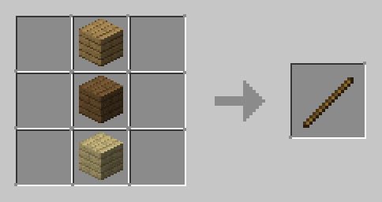
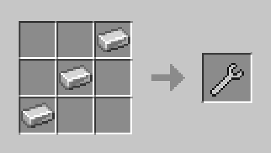
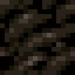
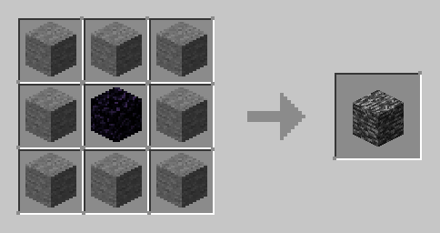
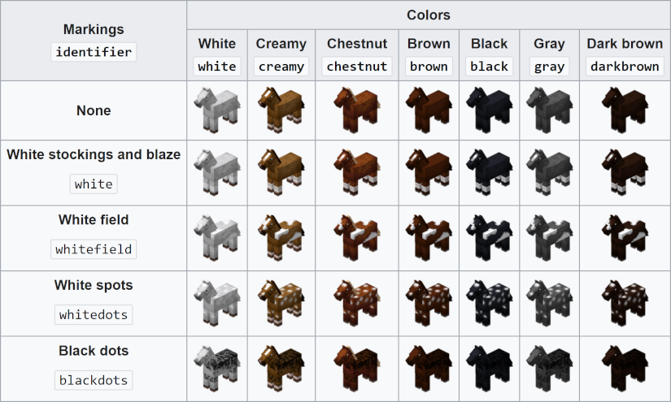
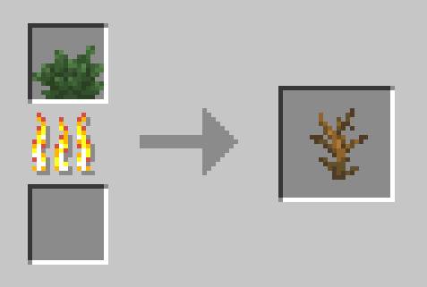

# EchoTweaks

My small additions, for Minecraft 1.21.11 [(Fabric)](https://fabricmc.net/use/installer/)

<details open>
<summary>

## <ins>*Quick Navigation*</ins>

</summary>

- [Dependencies & Relations](#dependencies--relations)
- [Additions](#additions)
	- [Commands](#commands)
		- [heal](#heal)
		- [name](#name)
		- [platform](#platform)
		- [unbreakable](#unbreakable)
	- [Items](#items)
		- [Big Stick](#big-stick)
		- [Wrench](#wrench)
	- [Blocks](#blocks)
		- [Charcoal Block](#charcoal-block)
		- [Gabbro](#gabbro)
	- [Advancements](#advancements)
	- [Advancement Triggers](#advancement-triggers)
	- [Statistics](#statistics)
		- [Per-Entity Bred](#per-entity-bred)
- [Changes](#changes)
	- [Advancements](#advancements-1)
		- [Total Beelocation](#total-beelocation)
	- [Recipes](#recipes)
		- [Dead Bush](#dead-bush)
	- [Visual](#visual)
	- [Gameplay](#gameplay)
		- [Blue Axolotls](#blue-axolotls)
		- [Swamp Oaks](#swamp-oaks)

</details>

## Dependencies & Relations
EchoTweaks **needs** the following to function fully:
- [Fabric API](https://www.curseforge.com/minecraft/mc-mods/fabric-api/files/7081265)
- [Cloth Config API](https://www.curseforge.com/minecraft/mc-mods/cloth-config/files/7060803)

It also supports [Mod Menu](https://www.curseforge.com/minecraft/mc-mods/modmenu/files/7059741), which is recommended for access to the config screen.

## Additions

### Commands

#### <ins>Heal</ins>
```
heal [<entity>] [<amount>]
```
Heals `entity` by `amount` health points.  
\- If `entity` is omitted, targets the executing entity.  
\- If `amount` is omitted, restores max health.

#### <ins>Name</ins>
```
name item <name>
```
Sets the `item_name` component for the Player's held item<br>
<br>
```
name entity <target> <name> [display]
```
Sets the `CustomName` and optionally `CustomNameVisible` NBT values<br>
<br>

#### <ins>Platform</ins>
```
platform [<main_block>|$use_held] [<size>] [<center_block>]
```
Fills `main_block` (or the block in your hand) in a square around you.<br>
\- Uses config if no arguments are given, or if `size` is missing.<br>
\- Each `size` correlates to a square of side-length `2*size + 1` centred on the player.

#### <ins>Unbreakable</ins>
```
unbreakable
```
Applies the `minecraft:unbreakable` component to the player's currently held item.

### Items

#### <ins>Big Stick</ins>
<br>
Only hits as well as a boring normal stick.<br>
Knocks attacked enemies very far away.<br>
Has 60 durability, loses 1 on attack, 2 on block break

#### <ins>Wrench</ins>
<br>
Is purely cosmetic, can be crafted back down into three ingots.

### Blocks

#### <ins>Charcoal Block</ins>
<br>
Functionally identical to the vanilla Coal Block, but for Charcoal.<br>
Also smelts the same 80 items.

#### <ins>Gabbro</ins>
<br>
Mostly just a Bedrock lookalike. End Crystals can be placed on it by default, and they can blow it up.<br>
(It's a fraction lighter than Bedrock.)

It's very strong, and requires at least a Diamond Pickaxe to drop.<br>
The Recipe unlocks when you get to bedrock level.

<br>

### Advancements
<details>
<summary>

#### *Skip to advancement*

</summary>

- [A Cacophonous Chorus](#a-cacophonous-chorus)
- [A Dense Octette](#a-dense-octette)
- [A Heavy Commitment / Serious Dedication](#serious-dedication)
- [Chestful Of Cobblestone](#chestful-of-cobblestone)
- [Conga Line](#conga-line)
- [Diamonds To You!](#diamonds-to-you)
- [Full Circle](#full-circle)
- [Fully Furnaced](#fully-furnaced)
- [Flower Power](#flower-power)
- [It's a New Record!](#its-a-new-record)
- [One with the Wild](#one-with-the-wild)
- [Overkill / Over-Overkill](#overkill)
- [Rainbow Collection](#rainbow-collection)
- [Rein Check](#rein-check)
- [Spitting Image](#spitting-image)
- [Stack Overflow](#stack-overflow)
- [The Lie](#the-lie)
- [You Monster](#you-monster)
- [Zoology](#zoology)
- [22 Soldiers](#22-soldiers)

</details>

#### <ins>A Cacophonous Chorus</ins>

"A Cacophonous Chorus"

Tame all 5 different colors of parrot

#### <ins>A Dense Octette</ins>

It sure is... sound.

Use all 8 differently-sounding Goat Horns.

#### <ins>Serious Dedication</ins>

The old one was better!

The vanilla 1.21.5 *Serious&nbsp;Dedication* (`minecraft:husbandry/obtain_netherite_hoe`) has been replaced by *A&nbsp;Heavy&nbsp;Commitment*, and demoted to a `goal` rather than a `challenge` (see [frame](https://minecraft.wiki/w/Advancement_definition)).

Instead, *Serious&nbsp;Dedication* (now `echotweaks:husbandry/break_netherite_hoe`) is restored to its former glory, requiring you to use up and break the precious tool.

#### <ins>Chestful Of Cobblestone</ins>

That's a lot.

Fill a single Chest with exactly 1,728 Cobblestone, and then open it.

(For the uninitiated, just fill a single Chest all the way.)

#### <ins>Conga Line</ins>

Come and join!

Create the longest possible [caravan](https://minecraft.wiki/w/Llama#Caravans), with a total of 10 Llamas.

#### <ins>Diamonds To You</ins>

Sharing is caring.

Have another entity pick up a diamond you have thrown on the ground, Players and Zombies alike.

#### <ins>Full Circle</ins>

Slayyyyy!

Kill the Ender Dragon 20 times.<br>
(You must get kill credit yourself. Gateways are not actually linked to this advancement.)

#### <ins>Fully Furnaced</ins>

That's more.

Fill your Inventory with exactly 2,368 Furnaces.

(Again, no counting is required. You'll know when you're done.)

#### <ins>Flower Power</ins>

They're pretty, right?

This one's simple, have all the Flowers at once.

<details>
<summary>&nbsp;(Specifically these 25)</summary>

```
minecraft:allium
minecraft:azure_bluet
minecraft:blue_orchid
minecraft:cactus_flower
minecraft:cornflower
minecraft:dandelion
minecraft:closed_eyeblossom
minecraft:open_eyeblossom
minecraft:lilac
minecraft:lily_of_the_valley
minecraft:oxeye_daisy
minecraft:peony
minecraft:pink_petals
minecraft:pitcher_plant
minecraft:poppy
minecraft:rose_bush
minecraft:spore_blossom
minecraft:sunflower
minecraft:torchflower
minecraft:red_tulip
minecraft:orange_tulip
minecraft:pink_tulip
minecraft:white_tulip
minecraft:wildflowers
minecraft:wither_rose
```

(Yes I know there are more things with "flower" in them)<br>
(and more things in `#minecraft:flowers`)<br>
(these are the ones that I say count)<br>
(they have petals idk)<br>
(don't @ me)

</details>

#### <ins>It's a New Record!</ins>

Nice one!

Collect all 21 Music Discs, and play each one in a Jukebox.

#### <ins>One with the Wild</ins>

Gotta catch'em all!

Tame everything that is can be tamed, be trusted by everything that can trust, build every golem that can be built, and ride every (living or undead) thing that can be ridden.

<details>
<summary>&nbsp;(Here's the list)</summary>

```
minecraft:camel (ride)
minecraft:camel_husk (ride)
minecraft:cat (tame)
minecraft:copper_golem (build)
minecraft:donkey (tame)
minecraft:fox (breed)
minecraft:happy_ghast (ride)
minecraft:horse (tame)
minecraft:iron_golem (build)
minecraft:llama (tame) OR minecraft:trader_llama (tame)
minecraft:mule (tame)
minecraft:nautilus (tame)
minecraft:ocelot (tame*)
minecraft:parrot (tame)
minecraft:pig (ride)
minecraft:skeleton_horse (ride)
minecraft:snow_golem (build)
minecraft:strider (ride)
minecraft:wolf (tame)
minecraft:zombie_horse (tame)
minecraft:zombie_nautilus (tame)
```

\* Ocelots cannot be tamed, but the can gain player "Trust" in a similar way
</details>

#### <ins>Overkill</ins>

You gotta wallk first.

It's just like it was before the new fancy Mace existed. Deal at least 9 hearts of damage in a single hit. *Over-Overkill* is now after this in the tree, but is otherwise unchanged.

#### <ins>Rainbow Collection</ins>

Loud and proud!

Have all 16 differently coloured wool blocks at the same time.

#### <ins>Rein Check</ins>

Quite the collection.

Collect (tame) all possible combinations of (living) horse colors and markings.

There are 7 colors and 5 markings, giving 35 different horse appearances.
<br>
(Image via [minecraft.wiki](https://minecraft.wiki/w/Horse#Appearance))

#### <ins>Ripped Genes</ins>

Teenage Mutant Ninja.. no, never mind.

Breed a Blue Axolotl `(Variant: 4)` and store it in a bucket.

#### <ins>Spitting Image</ins>

Well that was easy.

Tame all 4 different colors of Llama. Trader Llamas *do* count.

#### <ins>Stack Overflow</ins>

It's too deep!

Have a Bundle inside a Bundle inside a Bundle inside a Bundle inside a Bundle inside a Bundle inside a Bundle inside a Bundle inside a Bundle inside a Bundle inside a Bundle inside a Bundle inside a Bundle inside a Bundle inside a Bundle inside a Bundle inside a Bundle.

(Basically either just do it until you can't anymore, or, if you want to be interesting, get one of every color.)

#### <ins>The Lie</ins>

You will be baked. And then there will be cake.

Get together all the ingredients, combine then in just the right way, et voilà! A cake.

#### <ins>You Monster</ins>

Eh. It was bound to happen.

Crush a turtle egg.

#### <ins>Zoology</ins>

The world is full of life!

Breed animals 5 times.

This is a root advancement - It creates its own tab.

#### <ins>22 Soldiers</ins>

in a tank.

Pick up in a bucket, all 22 specially-named Tropical Fish<br>
(Listed in [this table](https://minecraft.wiki/w/Tropical_Fish#Names))

### Advancement Triggers

[(Here's the criteria format to help understand this list)](https://minecraft.wiki/w/Advancement_definition#Criteria)s

`crush_turle_egg` - No additional conditions.

`gain_ocelot_trust` - No additional conditions. 

`llama_joins_caravan`<br>
|- `int`: `min_length`<br>
|- `bool`: `requires_creamy`<br>
|- `bool`: `requires_white`<br>
|- `bool`: `requires_brown`<br>
|- `bool`: `requires_gray`<br>

Color checks succeed if any Llama in the caravan has the specidied color.

### Statistics

#### Per-Entity Bred
The statistic type `echotweaks.bred` counts how many times the player has successfully caused two entities to breed, for each entity type.

This is as opposed to the vanilla joint `animals_bred` stat.

## Changes

### Advancements

#### <ins>Total Beelocation</ins>
The game now correctly grants the advancement with Beehives, as well as Bee Nests.

### Recipes

> This section details new recipes involving vanilla items. Modded recipes are detailed in their respective items' sections.</span>

#### <ins>Dead Bush</ins>
<br>
This makes Dead Bushes renewable.

### Visual

<br>
Hidden Advancements will now show a small icon in their place in the advancement tree. This allows the player to know when they still have advancements to complete.

### Gameplay

#### Blue Axolotls

The chance for a baby Axolotl to be blue increases depending on how many axolotls the player has previously bred. It has a maximum of ⅒ at 600 breeds.

#### Swamp Oaks

When an Oak Sapling grows near swamp blocks, it will grow into a vanilla [Swamp Oak](https://minecraft.wiki/w/Oak#Swamp_Oak).

This is guaranteed if and only if a block in `#echotweaks:grows_swamp_oaks` is present in a 5x3x5 area around the sapling. By default, Lily Pads and Vines.

<hr>
<p style="color:lightgrey;text-align:center;">That's all.</p>
<hr>
